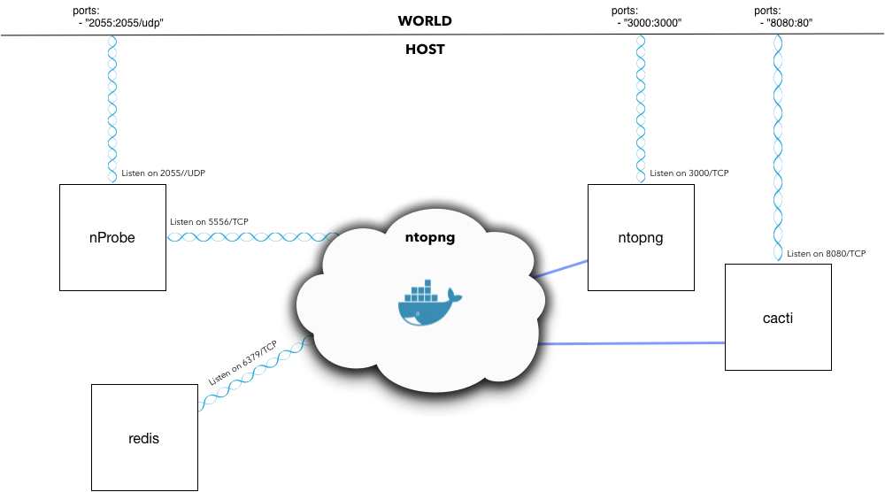

## Ntop+Nprobe



#### Missão

Uma instalação ntopng dockerizada que se comunica com uma instância nProbe. O objetivo da instância nProbe é fornecer uma coleta fluxo de qualquer dispostivo de rede que possui o Netflow habilitado. O resultado final será visualizado atraves do concentrador Ntopng.

#### Containers

- nprobe
- ntopng
- redis
- cacti

#### Redes:

- **ntopng** está escutando na porta 3000/TCP para conexões com o front-end da web. Está exposta ao mundo via 3000/TCP ou alguma outra porta TCP de sua escolha, configurável no arquivo docker-compose.yml.
- **nprobe** está escutando na porta 2055/UDP para dados de fluxo de entrada. Está exposto ao mundo via 2055/UDP ou alguma outra porta UDP de sua escolha.
- **nprobe** está escutando internamente, na rede ***ntopng***, porta 5557/TCP. Esta é a porta que o **ntopng** irá utilizar para capturar o fluxo de dados.
- **redis** está escutando internamente, na rede ***ntopng***, porta 6379/TCP.
- **cacti** está escutando na porta 8080/TCP para conexões com o front-end da web. Pode ser exposto ao mundo via 8080/TCP ou alguma outra porta TCP de sua escolha, configurável no arquivo docker-compose.yml.

**ntopng** não precisa de rede de host neste caso porque está "escutando" em: "" `--interface="tcp://nprobe:5557"`, aberta no **nprobe**'s na porta 5557/TCP na rede ***ntopng***.

#### docker-compose Notes

Ambos os serviços  **ntopng** e **nprobe** são construidos na inicialização . O arquivo `docker-compose.yml` está utilizando o `command: ["/etc/ntopng/ntopng.conf"]` e `command: ["/etc/nprobe/nprobe.conf"]` para informar ao ntop e nprobe, respectivamente, buscando suas configurações. Se você deseja fornecer suas próprias opções de inicialização, altere os arquivos de configuração antes de compilar ou forneça-os como um array para o `command:`. Exemplo: Para iniciar o nprobe com opções de linha de comando em vez do arquivo de configuração, altere:

```
command: ["/etc/nprobe/nprobe.conf"]
```

To this:

```
command: ["--zmq", "tcp://*:5557","--collector-port","2055","-n","none","-i","none"]
```

Observe também os nomes das imagens sendo usados ​​na compilação com o valor `image:` em `docker-comose.yml`. Se você quiser renomeá-los ou marcá-los de maneira diferente, o `docker-compose.yml` é o local para isso.

`docker-compose up -d --build` Irá subir todos os serviçõs necessários. Voce poderá logar em **ntopng** na porta *3000*, utilzando o IP do seu HOST.

Agora você deve poder visualizar o tráfego de qualquer dispositivo de rede enviando dados de fluxo para o IP do seu host em 2055/UDP.

#### Fontes de pesquisa
- https://github.com/x-drum/docker-nprobe
- https://github.com/goatatwork/ntopng-nprobe-docker
